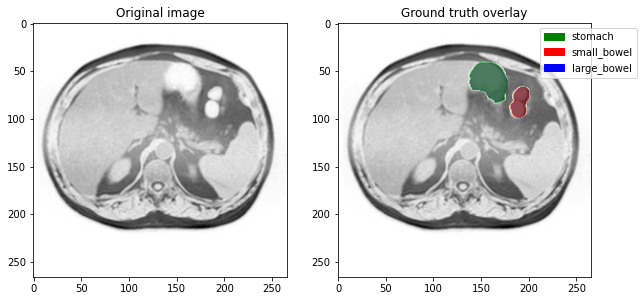
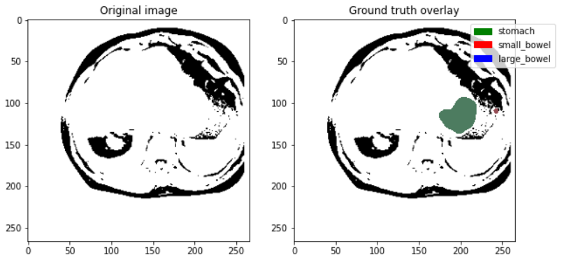
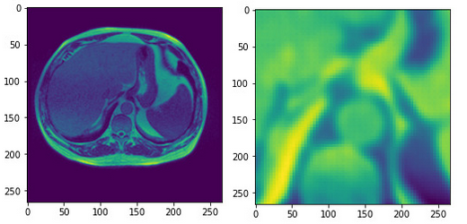
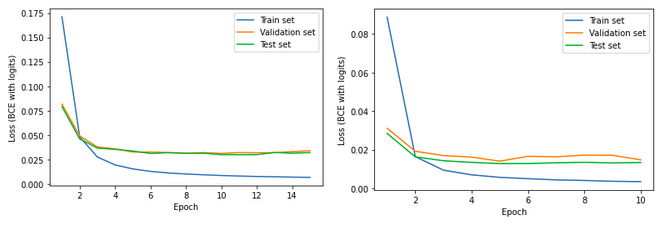
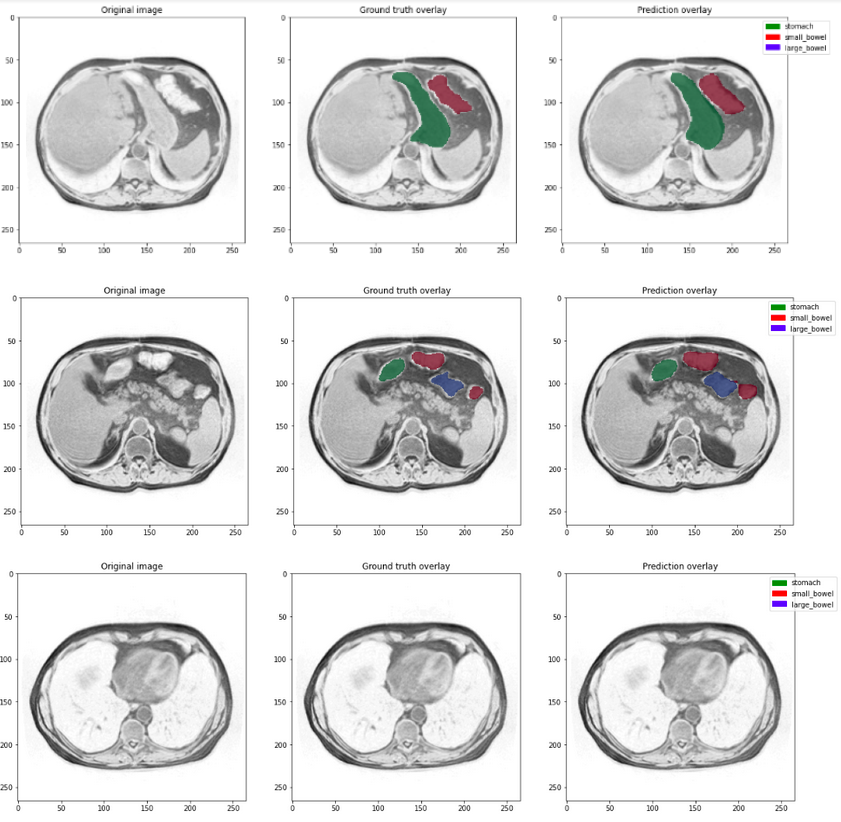
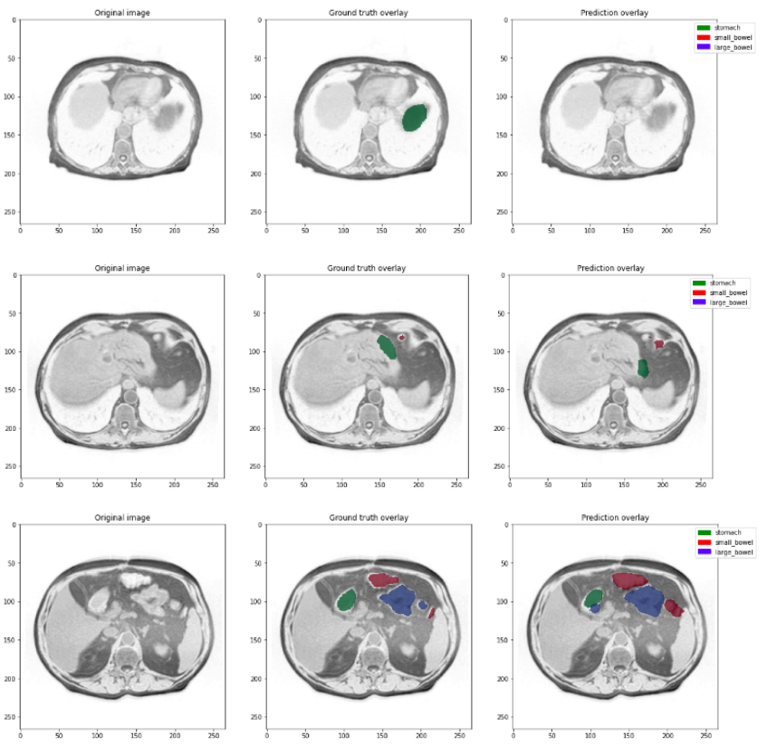
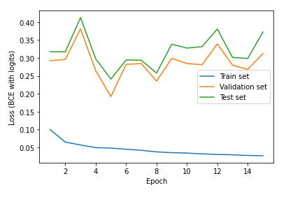

# Segmenting MRI scans using deep learning to improve cancer treatment

> By Paul Hueber, Jord Molhoek and Sven van der Voort. This blog post was written as part of the course [CS4245 Seminar Computer Vision by Deep Learning](https://studiegids.tudelft.nl/a101_displayCourse.do?course_id=57467) at Delft University of Technology.

## Introduction

Cancer in the gastro-intestinal tract is a condition that affects over 5 million people worldwide each year. About half of the diagnosed patients can be treated with radiation therapy. For successful treatment it is vital to deliver high doses of radiation to the tumor but avoid healthy organs such as the stomach or bowels. Guided radiation based on MRI scans allows for such precise radiation therapy but results in treatments lasting up to an hour a day because oncologists must manually annotate the MRI data. This causes high discomfort for patients and requires valuable time from doctors and nurses. Automating the detection and segmentation of vulnerable organs could reduce treatment times from 1 hour to 15 minutes per day increasing patient comfort and treatment effectiveness. ([source](https://www.kaggle.com/competitions/uw-madison-gi-tract-image-segmentation/overview/description))

This blog describes our efforts to build a deep learning model that will automatically segment healthy organs on MRI scans and potentially contribute to the medical solution for automated MRI annotation. We first describe the dataset that was used to train the deep learning models. Then we discuss the model architecture and its considerations. Then the results from several different experimental setups are presented. Finally, we provide a conclusion of our work and give suggestions for future work.

## Dataset

The initial problem statement and dataset is provided by the [UW-Madison GI Tract Image Segmentation competition](https://www.kaggle.com/competitions/uw-madison-gi-tract-image-segmentation) on Kaggle. Kaggle is a machine learning experimentation platform that hosts competitions with machine learning and data science challenges. For our research we used both the dataset and one of the evaluation metrics provided by the competition.

The dataset consists of (anonymized) data from 85 patients where each patient has scans taken over multiple days. The MRI scans are 2.5D, meaning that a full MRI scan is represented by approximately 144 images of consecutive *slices* of the patient's body. Each slice contains ground truth segmentations for three classes: stomach, small bowel and large bowel. If a class is not visible in the slice, the ground truth segmentation is empty. An example of the data including ground truth annotation can be seen in figure 1.

**Bad cases and dataset splits**

Unfortunately, the dataset was not entirely ready to use. During data exploration, we found some bad cases. An example is given in Figure 2. These cases were manually filtered out. Recall that the dataset consists of 85 patients. Each patient has 1 to 6 days of scans, and each day contains 144 slices. We found that a bad slice means that all slices on that day are bad and in most cases all scans of this patient are of poor quality. Hence, if a patient has at least one day of bad scans, the whole patient is filtered out. This procedure decreased the dataset size from 85 to 39 patients. Leveraging the information that is still hidden in these bad cases is left for future work.

Furthermore, the dataset needed to be split into training-, testing-, and validation sets. To reduce the possibility of overfitting, the splits are done on patients, and not on days or slices. The size of the training-, testing-, and validation sets are 29, 5 and 5 patients respectively. Ideally, evaluation should be done using k-fold-crossvalidation however due to time constraints and compute power availability this was not feasible. Instead two random train/test/validation splits were manually selected. All experiments were run on both dataset splits. These two values can give us an indication of how much variation can be expected if the experiments were to be repeated.

## Model and data preprocessing

**Data preprocessing and augmentation**

The raw data was preprocessed and augmented (artificially extended) before it was used for training. The MRI scans have several different resolutions because the scans were taken on different MRI machines. To enable use of all existing data across the varying resolutions, images were rescaled to a common size of 266x266. This size was chosen as it already made up the majority of the scans. Furthermore, training data was augmented using random cropping and label smoothing. Random cropping augmentation removes a random amount of pixels from each border (uniform distribution of 0-10 pixels) and resizes the image to the target resolution. We applied label smoothing on the ground truth mask using a 3x3 pixel kernel, where all non center values were set to 1 with a specified probability of 0.4. Label smoothing was chosen because a bigger segmentation is preferable over a smaller one for this use case: hitting a vulnerable organ during radiation therapy has to be avoided at all cost. As a final preprocessing step, the MRI scans were normalized to a mean of 0.458 with a standard deviation of 0.229 [as recommended](https://pytorch.org/hub/pytorch_vision_fcn_resnet101/) for the particular model used.

**Model architecture**

Initially we experimented with a [U-Net](https://arxiv.org/abs/1505.04597) architecture to train the model. We used the PyTorch implementation from [this blog post by Aman Arora](https://amaarora.github.io/2020/09/13/unet.html). U-Net has been used with great success on other medical imaging datasets and we expected similar results for our dataset. However, the network failed to converge on any dataset bigger than a single slice. Its output was simply a cropped and deformed version of the input slice as can be seen in figure 3. Through a small ablation study we determined that the network can learn from a single input image, but unfortunately it is still unknown to us why the network fails to converge on multiple images.

The network architecture actually used for segmentation is a [Fully Convolutional Network](http://arxiv.org/abs/1605.06211) with a ResNet-50 [ResNet](http://arxiv.org/abs/1512.03385) backend. A Fully Convolutional Network uses a successful existing classification architecture but uses convolutional layers rather than fully connected layers as the final layers in the network (see figure 4). The Fully Convolutional Network architecture therefore builds on the strengths of the existing classification architecture and adapts it for segmentation. The model implementation was loaded from the [PyTorch model hub](https://pytorch.org/hub/pytorch_vision_fcn_resnet101/) without pre-trained weights and three output channels (corresponding to the three classes in the dataset).

## Results

**Training**
The model was trained on two different dataset splits and with data preprocessing and augmentation as described in the sections above. A batch size of 32 MRI scans (slices) and the Adam optimizer was used with a learning rate of 0.0001. Binary Cross Entropy loss with logits was used as loss and early stopping was applied with a patience of 5 epochs. We evaluated several different configurations differing in type of loss, learning rate and optimizer in order to reach the final configuration. This does not qualify as a full hyperparameter search, but it allowed us to somewhat optimize the performance of the network. 

Training was done on two setups; the data for which the slices with empty ground truth are filtered out and the full dataset. In both datasets, the bad cases are filtered out as described in section **Bad cases and dataset splits**. Furthermore, both setups are trained twice on different training/validation/testing splits in order to give an indication of the variation. The learning curves are visually similar, hence only one curve per setup is shown. The learning curves in figure 5 shows the network loss during training. The network quickly converges to reach optimal performance on the validation and test set. Then the network starts to overfit on the training data. 

**Evaluation**
At last the models were evaluated using the mean Dice coefficient. This measure computes the pixel-wise overlap between predicted segmentation and its respective ground truth and ranges from 0 to 1. A score of 1 corresponds to a perfect overlap of prediction and ground truth. If both masks are empty, the Dice coefficient is defined to be 0. This evaluation metric is also used by Kaggle in combination with a 3D Hausdorff to determine the final performance of the entered submissions.
For the evaluation we use a sigmoid on the final layer of our network to squash its output. We iterated over different thresholds and computed the Dice coefficient on the validation data. The threshold at 0.4 attained the best performance and consequently was used for further testing.

For illustrative purposes, some example segmentations are reported. The examples are segmented by the network that was trained on all data. Figure 6 shows examples of good cases, where the segmentation is nearly perfect.

Unfortunately, not all slices from the test set are as good. Figure 7 below shows examples of bad cases. Especially the first two cases, where vital organs are missed, could have serious consequences if this model were to be actually used in the medical domain without a medical expert supervising the outputs of the model. These cases illustrate why future work is essential. Although the segmentation on the third example is far from perfect, it does successfully serve the purpose of indicating areas that need to be avoided by the radiotherapy.

In table 1 we report the results attained when training and evaluating on the full dataset (all gt) and the dataset of only slices with segmentations present (non-empty gt).
The first model was both trained and evaluated on non-empty ground truth and corresponds to a network that is only used to segment MRI scans with vulnerable organs present. This model attained a mean Dice coefficient of 0.6345 which shows that the network is capable of correctly segmenting these organs. This setting, however, is not realistic as the majority of the slices of the MRI will require no segmentation. The second row of this table presents the performance of this model trained on realistic data and it comes to no surprise that the performance is much worse. 
The next model was trained on both slices with segmentations and without and notably the Dice coefficient when evaluated only on data with ground truth deteriorates only minimally to 0.5925. When tested on all images an average value of 0.691 was achieved. 

| Trained on | Evaluated on | Dice coef. (run 1) | Dice coef. (run 2) |
| -------------- | -------------- | ----- | ----- |
| Only non-empty | Only non-empty | 0.609 | 0.660 |
| Only non-empty | All data       | 0.258 | 0.287 |
| All data       | Only non-empty | 0.539 | 0.646 |
| All data       | All data       | 0.733 | 0.649 |

Table 1: Dice score evaluation of both networks on empty and non-empty ground truth test sets.

**Two-stage classification/segmentation network**

Table 1 shows the networks trained on all data including empty slices performs best overall. However when evaluated on a test set with only non-empty slices, the network trained for this purpose outperforms the latter ‘general’ network. We could use this to increase performance by using the ‘specialized’ network trained on non-empty slices only if we know there is indeed a segmentation present. This would create a two-stage network where a first-stage classification network determines whether we should run the second-stage specialized segmentation model, see figure 8.

We attempted to train a classification model to do the first-stage selection using the [PyTorch Hub ResNet50 implementation](https://pytorch.org/hub/nvidia_deeplearningexamples_resnet50/) appended with a linear 1000 to 3 layer, the Adam optimizer and Binary Cross Entropy with logits loss. We tried several learning rates 0.001, 0.0001 and 0.00001 but none allowed the network to generalize. This can also be seen in the learning curves in figure 9. Evaluation of the trained classification networks shows that the network has either recall of 1.0 or precision of 1.0, indicating that the network simply classifies everything as positive or negative. Due to time limitations we did not investigate these issues further and leave the idea for a two-stage network here for future research.

## Conclusions and future work

This blog post introduces and evaluates an image segmentation model for automated MRI scan annotation to speed up radiation treatments. Although the results show it is possible to train a deep learning model for this task, its performance is not yet sufficient to use the model in the medical domain.

Much performance can likely be gained by exploiting the 2.5D structure of the data and the relationships between scans over time. Future work could solve this for example by using 3D convolutions on multiple slices rather than a single slice at a time. Alternatively sequential deep learning methods such as Long Short Term Memory or transformers could be applied on sequential slices and even on slices of consecutive days. The idea of a two-stage network could be further explored to take advantage of a ‘specialized’ segmentation network. Finally, a more extensive hyper-parameter search and ablation study on the network architecture and data augmentation could provide insights into limitations and areas of improvement of the model.

> All code used for generating the results in this blog post can be found on [this GitHub repository](https://github.com/svenvdvoort/scv-tract-image-segmentation).
